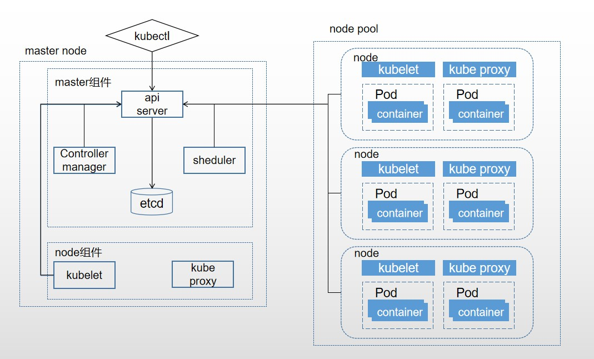

# 1. k8s架构



Kubernetes是由一组节点组成，这些节点可以是物理主机，也可以是虚拟机。Kubernetes平台运行这些节点之上，构成了集群。Kubernetes集群分为两种Node，一种Master Node和用于实际部署的Pod的工作Node。一个集群往往由多个Master Node，这几个Master Node控制着整个集群的所有Node。

master节点包含以下组件:

* etcd 用于存储集群中所有对象产生的数据
* api server 唯一可以和etcd 数据库交互的组件，通过通过kubectl调用api server 的api
* controller manager 管理资源对象
* schedualer 调度Node，发布Pod

node节点包含以下组件:

* kubelete 用于和Master节点交互，运行了node上的Service进程
* kube-proxy 负责网络相关，用于服务的负载

# 2. Master 组件

> Master 组件提供的集群控制。Master 组件对集群做出全局性决策(例如：调度)，以及检测和响应集群事件(副本控制器的replicas字段不满足时,启动新的副本)。

> Master 组件可以在集群中的任何节点上运行。然而，为了简单起见，设置脚本通常会启动同一个虚拟机上所有 Master 组件，并且不会在此虚拟机上运行用户容器。

## 2.1 etcd 

参考链接： [ETCD 简介 + 使用](https://blog.csdn.net/bbwangj/article/details/82584988)
### 概念

> A highly-available key value store for shared configuration and service discovery.

一个高可用的键值存储仓库，用于配置共享和服务发现。分布式系统中的数据分为控制数据和应用数据。使用etcd的场景默认处理的数据都是控制数据，对于应用数据，只推荐数据量很小，但是更新访问频繁的情况。

相比于zk，etcd注重以下四点：

* 简单：基于HTTP+JSON的API让你用curl就可以轻松使用
* 安全：可选SSL客户认证机制
* 快速：每个实例每秒支持一千次写操作
* 可信：使用Raft算法充分实现了分布式

### 架构


从etcd的架构图中我们可以看到，etcd主要分为四个部分:

* HTTP Server： 用于处理用户发送的API请求以及其它etcd节点的同步与心跳信息请求
* Store：用于处理etcd支持的各类功能的事务，包括数据索引、节点状态变更、监控与反馈、事件处理与执行等等，是etcd对用户提供的大多数API功能的具体实现
* Raft：强一致性算法的具体实现，是etcd的核心(对于leader选举的算法值得深入看一下)
* WAL：Write Ahead Log（预写式日志），是etcd的数据存储方式。除了在内存中存有所有数据的状态以及节点的索引以外，etcd就通过WAL进行持久化存储。WAL中，所有的数据提交前都会事先记录日志。Snapshot是为了防止数据过多而进行的状态快照；Entry表示存储的具体日志内容

### 一般流程

> 通常，一个用户的请求发送过来，会经由HTTP Server转发给Store进行具体的事务处理，如果涉及到节点的修改，则交给Raft模块进行状态的变更、日志的记录，然后再同步给别的etcd节点以确认数据提交，最后进行数据的提交，再次同步

## 2.2 Api Server

参考资料: [k8s-API server原理分析](https://blog.csdn.net/hahachenchen789/article/details/80630426) 、[Kubernetes 之APIServer组件简介](https://blog.csdn.net/bbwangj/article/details/81904421)、 [kubernetes 简介：API Server 简介](https://blog.csdn.net/liukuan73/article/details/54971854)

### 概念

在 kubernetes 集群中，API Server 有着非常重要的角色。API Server 负责和 etcd 交互（其他组件不会直接操作 etcd，只有 API Server 这么做），是整个 kubernetes 集群的数据中心，所有的交互都是以 API Server 为核心的。简单来说，API Server 提供了以下的功能:

* 整个集群管理的 API 接口：所有对集群进行的查询和管理都要通过 API 来进行
* 集群内部各个模块之间通信的枢纽：所有模块之前并不会之间互相调用，而是通过和 API Server 打交道来完成自己那部分的工作
* 集群安全控制：API Server 提供的验证和授权保证了整个集群的安全
* 是资源配额控制的入口

### 使用

1. 对于我们自己安装玩的，所有的操作都可以直接通过 8080 非安全端口访问，支持curl命令

    ```
      curl http://master地址:8080  会返回api-server提供的接口列表
    ```
2. 提供简单的安全服务:
    可以在master或其他任何节点上通过运行kubectl proxy进程启动一个内部代理来实现部分服务的对外暴露

    ```
    kubectl proxy --reject-paths="^/api/v1/replicationcontrollers" --port=8001 --v=2
    ```

    再次访问/api/v1/replicationcontrollers时，就会出现unAuthorized

3. api-server提供了各个模块之间的通信，我们常用的kubectl命令就是封装了相关的api-server接口，比如创建pod就可以使用 curl POST 命令（对于这些接口，可以使用相关语言开发，继而形成像zhongyi的容器云环境).

## 2.3 Controller-manager

### 概念

运行控制器，它们是处理集群中常规任务的后台线程。逻辑上，每个控制器是一个单独的进程，但为了降低复杂性，它们都被编译成独立的可执行文件，并在单个进程中运行。当某个Node意外宕机时，Controller Manager会及时发现并执行自动化修复流程，确保集群始终处于预期的工作状态。

这些控制器包括:

* Node controller(节点控制器): 当节点移除时，负责注意和响应
* Replication Controller(副本控制器): 负责维护系统中每个副本控制器对象正确数量的 Pod
* Endpoint Controller(端点控制器): 填充 端点(Endpoints) 对象(即连接 Services & Pods)
* Service Account & Token Controllers(服务帐户和令牌控制器): 为新的命名空间创建默认帐户和 API 访问令牌.

> 每个Controller通过API Server提供的接口实时监控整个集群的每个资源对象的当前状态，当发生各种故障导致系统状态发生变化时，会尝试将系统状态修复到“期望状态”。

## 2.4 Scheduler调度器

> 监视没有分配节点的新创建的 Pod，选择一个节点供他们运行。

通过API Server的watch接口监听新建Pod副本信息，并通过算法为该pod选择一个合适的node。调度器可用选择合适的策略，策略的考虑包括个人和集体资源的情况，软件、硬件条件的影响，亲和性和反亲和性的规范等因素。调度器是可插拔的，并且我们期待支持多集群的调度，未来甚至希望可以支持用户自定义的调度器。

# 3. Node组件

Node是K8s集群中真正的工作负载节点，K8s集群由多个Node共同承担工作负载，pod被分配到某个具体的node上执行。k8s通过node controller对node资源进行管理。支持动态在集群中添加或删除node。

## 3.1 kubelet

### 概念

在kubernetes集群中，每个Node节点都会启动kubelet进程，用来处理Master节点下发到本节点的任务，管理Pod和其中的容器。kubelet会在API Server上注册节点信息，定期向Master汇报节点资源使用情况，并通过cAdvisor监控容器和节点资源，而且它还会向Master汇报容器运行的健康情况。

### 功能

监测已分配给其节点的 Pod(通过 apiserver 或通过本地配置文件)，提供如下功能：

* 挂载 Pod 所需要的数据卷(Volume)
* 下载 Pod 的 secrets
* 通过 Docker 运行(或通过 rkt)运行 Pod 的容器
* 周期性的对容器生命周期进行探测
* 如果需要，通过创建 镜像 Pod（Mirror Pod） 将 Pod 的状态报告回系统的其余部分
* 将节点的状态报告回系统的其余部分

## 3.2 kube proxy

> 服务发现

Service抽象概念的实现，将到service的请求按策略（负载均衡算法分发到后端的pod ）上，默认使用iptables mode实现；支持nodeport模式，实现从外部访问集群内的service

# 其他组件

* coreDNS： 可以为集群中的SVC创建一个域名IP的对应关系解析
* dashboard: 给k8s集群提供一个 B/S结构访问体系
* ingress controller： 官方只提供四层代理，ingress提供7层
* federation： 提供一个可以跨集群中心多k8s统一管理的功能
* prometheus: 提供k8s集群的监控能力
* EFK： 提供k8s集群日志统一分析介入平台


