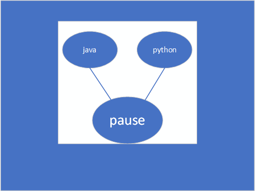
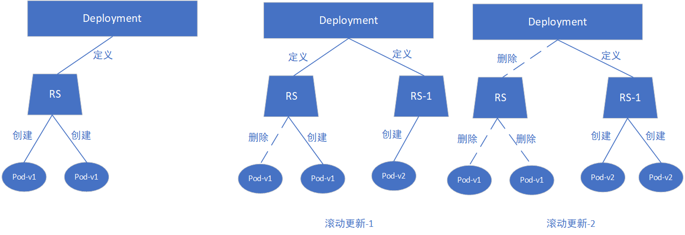

Pod

# Pod

## 1 概念
参考资料： [k8s-pod控制器](https://www.cnblogs.com/weiyiming007/p/10246118.html)

### 1.1 自主式Pod

> 在非正常结束的情况下无法自动重新启动一个新的Pod。

自主式Pod是自我管理的，创建以后，仍然是提交给API Server,由API Server接收后借助Scheduler将其调度到指定的node节点，然后由node启动此节点，如果有pod中容器出现问题了，需要重启容器，那是由Keepalived来完成，但是如果节点故障了,pod也就消失了，所以，它有这样的坏处，没办法实现全局的调度，所以建议使用第二种pod。

### 1.2 控制器管理的Pod

> 由控制器管理启动的Pod在异常退出的时候 控制器会自动创建新Pod

由于是控制器这种机制，使得在K8S上的集群设计中，pod完全就可以叫做有生命周期的对象，而后由调度器调度到集群中的某节点，运行以后，它的任务终止也就随着被删除掉，但是有一些任务，大家知道传统上有nginx、tomcat，它们是做为守护进程运行的，那么这种运行为pod容器的话，我们要确保它是时刻运行的，一旦出现故障我们要第一时间发现，要么是重建取代它，要么是重启，那么pod控制器就可以观测并实现

## 2 Pod组成

> Pod是由一个或多个container组成的，只要pod一被创建，内部就有一个名为pause的容器启动，其他容器共用pause的网络栈，同时其他Pod也共享pause的存储卷，所以在一个pod内部，各个容器的端口不能冲突，且容器之间可以使用localhost来互相调用。

## 3 Pod控制器类型

参考资料： [Pod控制器](https://www.cnblogs.com/linuxk/p/9578211.html)

### 3.1 ReplicationController(RC)

> 用来确保容器应用的副本数始终保持在用户定义的副本数，即如果有容器异常退出，会自动创建新的Pod来替代；而如果异常多出来的容器也会自动回收。

### 3.2 ReplicaSet(RS)

> 新版本的kubernetes中建议使用RS来取代RC，RS和RC没有本质的不同，RS支持集合式的selector。

比如我们在创建POd时，需要指定标签、版本号、元数据等，创建了很多个Pod，如果要对Pod按照这些信息修改，使用RC就要一个一个的区修改，而用RS可以在selector中去指定该一系列的。

虽然RS可以独立使用，但一般还是建议使用Deployment来自动管理RS，这样就无需担心跟其他机制不兼容的问题(比如RS不支持rolling-update)。

### 3.3 Deployment

> Deployment为Pod和Replica Set（下一代Replication Controller）提供声明式更新。Deployment不负责创建Pod，可以支持滚动更新。

### 3.4 HPA(Horizontal Pod AutoScale)

> HPA仅适用于Deployment和RS，在v1版中仅支持Pod的CPU利用率扩缩容；在vlapha版中，支持根据内存和用户自定义的metric扩缩容

比如：创建一个Pod，设置HPA CPU > 80%，进行扩容，max=10，min=2，则在Pod的cpu利用率超过80%时创建新的Pod，直到Pod的cpu利用率低于80%，但最多不超过10个，当cpu利用率变低时，删除Pod，最小2个。

### 3.5 StatefullSet

> 为了解决有状态服务的问题(对应于Deployments和RS是为无状态服务而设计)。

应用场景如下：

* 稳定的持久化存储，即Pod重新调度后还是能访问到相同的持久化数据，基于PVC实现
* 稳定的网络标志，即Pod重新调度后其PodName和HostName不变，基于Headless Service(即没有ClusterIP的service)来实现
* 有序部署，有序扩展： 在部署或者扩展的时候要依据定义的顺序依次进行，基于init containers来实现
* 有序收缩，有序删除

### 3.6 DaemonSet

> 确保全部(或者一些--打了污点的Node不会运行)Node上运行一个Pod的副本；当有Node加入集群时，也会为他们新增一个Pod；当有Node从集群中移除时，这些Pod会被回收。删除DaemonSet会将删除它创建的所有Pod。

典型用法:

* 运行集群存储daemon，例如在每个Node上运行glustered、ceph
* 在每个Node上运行日志收集daemon，例如fluentd、logstach
* 在每个Node上运行监控daemon，例如Prometheus Node Exporter

### 3.7 Job & CronJob

> Job负责批处理任务，即仅执行一次的任务，保证批处理任务的一个或多个Pod成功结束

> CronJob 管理基于时间的Job，即：
    1、 在给定时间点只运行一次
    2、 周期性的在给定时间点运行

