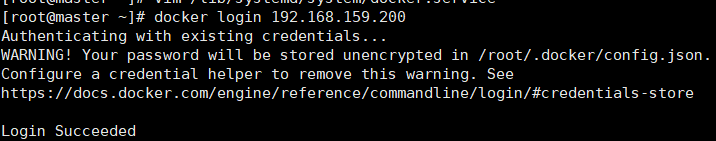
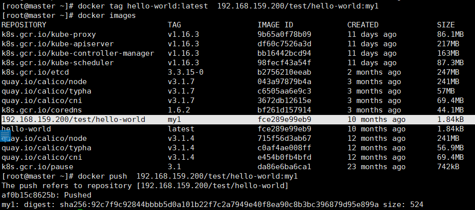
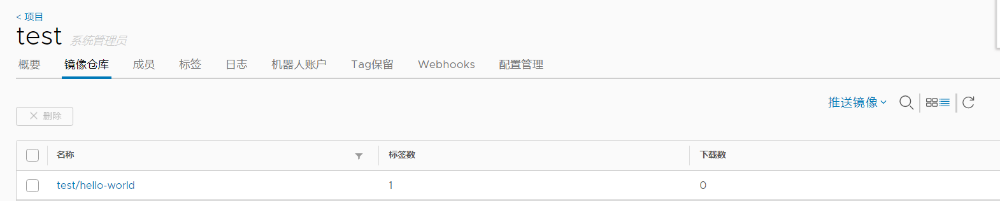

<center>搭建Harbor仓库</center>

## 环境准备

* 配置静态ip

    > 同上述一样，设置harbor虚拟机ip为 192.168.159.200

* 安装docker

    ```
    yum update

    yum remove docker docker-common docker-selinux docker-engine

    yum install -y yum-utils device-mapper-persistent-data lvm2

    yum-config-manager --add-repo https://download.docker.com/linux/centos/docker-ce.repo

    yum install epel-release

    yum -y install docker-ce docker-compose

    查看docker以及docker-compose版本
    docker --version
    docker-compose -version
    ```

## harbor安装配置

* harbor准备

    1. 安装包下载地址： https://github.com/goharbor/harbor/releases 这次我下载的是 harbor-offline-installer-v1.9.3.tgz

    2. 解压后得到 ```harbor``` 文件夹

    3. 进入```harbor```文件夹，修改```harbor.yml```文件

        ```
        hostname: 192.168.159.200 #其余的看着改就行
        ```
    4. 依次执行

        ```
        ./prepare
        ./install.sh
        ```
    5. 登录Harbor-ui，输入hostname，用户名：admin，密码：```harbor.yml```中配置的```harbor_admin_password: admin```,初次进入最好修改密码

* k8s集群连接harbor

    1. 在master中修改docker的service

        ```
        vim /lib/systemd/system/docker.service
        ```
        在ExecStart处添加 –insecure-registry 参数：

        ```
        ExecStart=/usr/bin/dockerd -H fd:// --containerd=/run/containerd/containerd.sock --insecure-registry=192.168.159.200
        ```
        修改后，重启docker
        ```
        systemctl daemon-reload
        systemctl restart docker
        ```

    2. 测试harbor

        * 初次登陆需要输入用户名密码

            
        
        * 在harbor中新建项目test，推送本地镜像

            ```
            docker tag SOURCE_IMAGE[:TAG] 192.168.159.200/test/IMAGE[:TAG]
            docker push 192.168.159.200/test/IMAGE[:TAG]
            ```
        
        * 推送成功

        

        