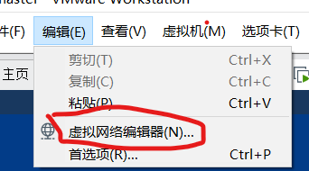

<center>docker安装</center>

# 使用VMWare搭建分布式基础环境

##  安装准备

1. 软件：

```
centos镜像：CentOS-7.6-x86_64-DVD-1810.iso
虚拟机：VMware-workstation-full-15.5.1-15018445.exe
```

2. 部署方案

本次安装采用三个节点，一个master，两个node，各节点详细信息如下：

```
              静态ip                hostname       cpu     memory
Master    192.168.159.100           master         4C       4G
node-01   192.168.159.110           node-01        4C       4G
node-02   192.168.159.120           node-02        4C       4G
```

## 安装步骤

* 设置静态ip

    1. 如图，设置VMware的NAT参数,需要需要管理员权限更改配置,设置虚拟机
    
    ```
       子网ip：  192.168.159.0
       子网掩码：255.255.255.0
       网关：    192.168.159.2
    ```

    

    

    

* 分别启动三台虚拟机，以master为例，修改静态ip为192.168.159.100

vim /etc/sysconfig/network-scripts/ifcfg-ens33 

```
TYPE="Ethernet"
PROXY_METHOD="none"
BROWSER_ONLY="no"
BOOTPROTO="static"
DEFROUTE="yes"
IPV4_FAILURE_FATAL="no"
IPV6INIT="yes"
IPV6_AUTOCONF="yes"
IPV6_DEFROUTE="yes"
IPV6_FAILURE_FATAL="no"
IPV6_ADDR_GEN_MODE="stable-privacy"
NAME="ens33"
UUID="56ff60a0-734f-4cbb-bc09-429d0d6da8f8"
DEVICE="ens33"
ONBOOT="yes"
IPADDR=192.168.159.100
NETMASK=255.255.255.0
GATEWAY=192.168.159.2
DNS1=114.114.114.114
```
主要是改BOOTPROTO为static，并添加IPADDR、NETMASK、GATEWAY、DNS1(必须有)，修改成功后重启加载网络配置

```
systemctl restart network
ping www.baidu.com
```

* 网络配置
 
vim /etc/hosts 添加如下内容：

```
192.168.159.100 master
192.168.159.110 node-01
192.168.159.120 node-02
```
重启虚拟机

* 升级centos内核

该版本centos内核为3.10.0，升级为最新版  

查看内核版本 ```uname -r```

查看虚拟机版本 ``` cat /etc/redhat-release```

1. 载入公钥

```
rpm --import https://www.elrepo.org/RPM-GPG-KEY-elrepo.org
```

2. 升级安装ELRepo

```
rpm -Uvh http://www.elrepo.org/elrepo-release-7.0-3.el7.elrepo.noarch.rpm
```

3. 载入elrepo-kernel元数据

```
yum --disablerepo=\* --enablerepo=elrepo-kernel repolist
```

4. 查看可用的rpm包

```
yum --disablerepo=\* --enablerepo=elrepo-kernel list kernel*
```
其中
lt  ：long term support，长期支持版本；
ml：mainline，主线版本

5. 安装最新版本的kernel

```
yum --disablerepo=\* --enablerepo=elrepo-kernel install  kernel-ml.x86_64  -y
```

6. 删除旧版本工具包

```
yum remove kernel-tools-libs.x86_64 kernel-tools.x86_64  -y
```

7. 安装新版本工具包

```
yum --disablerepo=\* --enablerepo=elrepo-kernel install kernel-ml-tools.x86_64  -y
```

8. 查看内核插入顺序

```
awk -F \' '$1=="menuentry " {print i++ " : " $2}' /etc/grub2.cfg
```

9.  查看当前实际启动顺序

```
grub2-editenv list
```

10.  设置默认启动

```
grub2-set-default '上面更新的内核版本全称'
```

或直接使用数值

```
grub2-set-default 0　　// 0代表当前第一行
```

11. 重启检查

```
reboot 
uname -r
```


