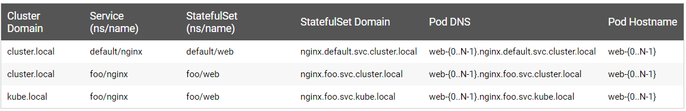

## 概念

StatefulSet是用来管理有状态的服务的。首先明确statefulSet是controller层级的，不能够对外暴露服务，主要功能是调度和扩展各个Pod，并且保证这些Pods的顺序性和唯一性。

和Deployment类似，statefulSet管理者一组具有相同的container spec，但区别是：statefulset和每个pod都是粘性绑定的。每个Pod虽然spec一致，但是不能互换，每个Pod都有一个永久性标识，在rebuild的时候也会维护。Deployment和ReplicaSet更适合无状态服务。

在该文中，stable稳定的意味着persistence，即在Pod生命周期及调度时不变。

## 使用场景

statefulSet通常应用在以下场景中：

* 唯一、稳定的网络标识
* 持久化、稳定的存储
* 有序，顺畅的部署和扩展
* 有序、自动的滚动更新

受限：

* Pod的存储必须由PV根据请求的storage class配置，或者由admin预先配置好
* delete或者scale操作不会将statefulSet的volumes删除，这么做是为了保证数据的安全性，比彻底删除statefulSet相关资源更有意义
* StatefulSets目前需要一个headless service来负责Pods的对外服务，这个service需要我们创建
* 当删除statefulSet时，不能保证相关的Pod会终止。为了有序、优雅的终止Pod服务，最好是scale to 0
* 当使用Pod的默认管理策略(OrderedReady)进行滚动更新时，可能会产生故障，需要手动干预修复

## 编写一个statefulSet

以下的示例演示了statefulSet的组件：
```
apiVersion: v1
kind: Service
metadata:
  name: nginx
  labels:
    app: nginx
spec:
  ports:
  - port: 80
    name: web
  clusterIP: None
  selector:
    app: nginx
---
apiVersion: apps/v1
kind: StatefulSet
metadata:
  name: web
spec:
  selector:
    matchLabels:
      app: nginx # has to match .spec.template.metadata.labels
  serviceName: "nginx"
  replicas: 3 # by default is 1
  template:
    metadata:
      labels:
        app: nginx # has to match .spec.selector.matchLabels
    spec:
      terminationGracePeriodSeconds: 10
      containers:
      - name: nginx
        image: k8s.gcr.io/nginx-slim:0.8
        ports:
        - containerPort: 80
          name: web
        volumeMounts:
        - name: www
          mountPath: /usr/share/nginx/html
  volumeClaimTemplates:
  - metadata:
      name: www
    spec:
      accessModes: [ "ReadWriteOnce" ]
      storageClassName: "my-storage-class"
      resources:
        requests:
          storage: 1Gi
```

在上例中：
* 名为nginx的headless service服务用来控制网络
* 名为web的statefulSet定义了spec：3个nginx容器副本将会运行在不同的Pod当中
* volumeClaimTemplates通过PersistentVolumn Provisioner配置的PersistentVolumn来提供稳定的存储。

### Pod Selector

在statefulSet中，.spec.selector必须与其 .spec.template.metadata.labels能够match labels。k8s 1.8版本之前，.spec.selector当忽略时按照默认的走；1.8及之后，将导致statefulSet创建时验证出错而失败。

### Pod Identity

statefulset的Pods具有唯一标识，由一个序号、一个稳定的网络标识和稳定的存储组成。该标识与Pod绑定，和调度到哪个node上无关。

1. 序号

对于有N个副本的statefulSet来说，其中的每个Pod将被分配一个从0到N-1的整数序号，每个都不相同。

2. stable network Id

每个Pod的hostname由statefulSet的名称以及pod的序号派生而来。hostname的格式是：$(statefulset name)-$(ordinal)。上面的例子将产生三个Pod，分别为web-0，web-1, web-2. 

StatefulSet使用headless service来控制Pods的域名。由Service管理的域名为以下格式：$(service-name).$(namespace).svc.cluster.local，其中cluster.local为集群的域名。当Pod创建完成后，要匹配DNS子域名，格式为：$(pod name).$(governing service domain)，其中governing service由statefulSet的serviceName定义。

前面limitations中提到过，用户需要创建headless service来提供pods的网络标识。

下面是上述格式及结果的一些示例：



3. stable storage

K8s为每个VolumnClaimTemplate都会创建一个PersistentVolume。在上面的nginx例子中，每个Pod会有一个PV，这个PV的StorageClass是my-storage-class且有1G的存储空间。如果不定义StorageClass，将使用默认的StorageClass。

当Pod被调度到node上时，他的volumeMounts将会挂载与 PVC关联的PV。**重点**：在删除Pod、StatefulSet时，和Pod的PVC关联的PV不会被删除，需要的话需要手动删。

4. Pod Name Label

当statefulSet控制器创建Pod时，会为Pod创建一个label：sattefulset.kubernetes.io/pod-name，值是Pod的name。Service可以使用该标签来关联Pod。

## 部署和扩展

* 对于具有N个副本的statefulSet，pod是按序创建的，{0...N-1}
* 当删除Pod时，按照逆序终止，{N-1...0}
* 任何Pod的scaling操作都需要前面的Running and Ready
* 终止Pod时，都需要后继的完全shutdown

StatefulSet不能指定 pod.Spec.TerminationGracePeriodSeconds为0，这个操作不安全，强烈不建议使用。

例如上面的nginx示例：

创建Pods时，顺序为web-0,web-1,web-2，当web-0 Running and Ready时，web-1才会创建，同理web-2。但在当web-1处于Running and Ready时，web-0处于fail时，web-2只有等到web-0也好了才会创建。

当将statefulSet的副本降为1时，首先终止web-2,然后是web-1。当web-2完全shutdown时，但是web-0处于fail,web-1不会终止知道web-0好了。

### Pod管理策略

在k8s 1.7版本之后，当通过.spec.podManagementPolicy字段保证唯一性和身份标识时，StatefulSet允许放宽顺序性。

* OrderedReady

StateSet默认的pod管理机制，其行为如上所示

* Parrallel

并行创建和终止Pod，不用等到Pod变成Running and Ready或者完全终止状态。这个操作只影响scaling，更新不受影响。

## 更新策略

在K8s 1.7版本及之后，StatefulSet的 .spec.updateStrategy 字段允许Pods的容器、标签、资源限额、注解(annotations)的自动滚动更新的配置和不生效。

### On Delete

当StatefulSet的 .spec.updateStrategy.type被设为OnDelete时，将不会自动更新Pods。用户需要先手动删除Pods，然后再根据 .spec.template创建新的Pods

### Rolling Updates

RollingUpdate策略是指自动、滚动更新Pods，默认策略。会自动删除和重建Pods。会按照从大到小的序号终止Pod，每次更新这个Pod，它会等到更新的Pod运行并准备就绪，然后再更新其前身。

* Partitions

通过指定.spec.updateStrategy.rollingUpdate.partition，RollingUpdate策略可以分区。在更新过程中，当指定了分区时，序号大于或等于分区的Pod会进行更新；小于分区的Pod不会更新，即使删除了该Pod，也会按照之前的版本再重建。如果StatefulSet的.spec.updateStrategy.rollingUpdate.partition大于其副本数，则对其.spec.template的更新将不会影响Pod。大多数情况下不会使用。

* Forced Rollback

如果将滚动更新与默认的Pod管理策略（OrderedReady）结合使用，则可能会陷入损坏状态，需要人工干预才能进行修复。例如二进制文件或者应用配置未见出错，StatefulSet将会陷入等待。在这种状态下，把Pod的template设置好了也不行，因为statefulSet还是会等待之前那个Pod处于Running and Ready状态才会更新下一个。

所以，在复原template之后，还要把之前卡住的Pod删了。然后statefulSet会用复原之后的template重建Pod。

## 强制删除StatefulSet

**注意**：StatefulSet正常情况下会自己删除、创建pod。当用到强制删除时，务必当心。

至多一种语义：statefulSet在集群当中，一个标识最多由一个Pod来提供。

强制删除statefulSet的Pod时，要保证被删除的Pod与集群中的其他Pod不会联系，其名称可以安全移除。

1.5及之后：
```
kubectl delete pods <pod> --grace-period=0 --force
```

1.4及之前：
```
kubectl delete pods <pod> --grace-period=0
```

执行了上述命令还处于Unknow状态，使用以下命令将Pod从集群中移除：
```
kubectl patch pod <pod> -p '{"metadata":{"finalizers":null}}'
```


