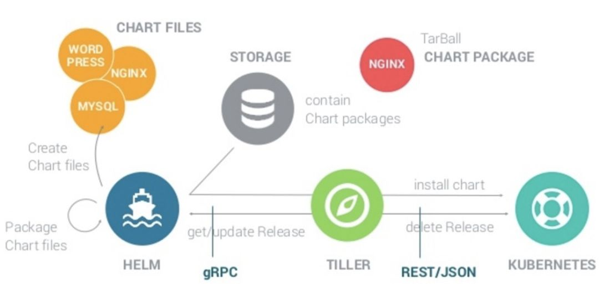

# K8s Helm 架构

## helm目的

helm是一个管理k8s软件包(charts)的工具。helm可以做：
* 从头创建新的charts
* 将charts打包成tgz文件
* 和存储charts的repo交互
* 在k8s集群中安装和卸载charts
* 使用helm管理charts的实例

对于helm，有三个关键概念：
* chart
* config：包含创建实例的配置信息
* release

## components

helm包含两个主要组件：

* helm client
  > 对于终端用户是一个命令行客户端。该客户端负责以下内容：
    * 本地chartkaifa
    * 管理repo
    * 和tiller服务端交互
      * 发送要安装的charts
      * 请求releases的信息
      * 请求更新或者卸载releases

* tiller server/(helm3--helm library)

    > 是一个集群内部服务器，可以和helm客户端以及k8s API server交互。服务器负责：
      *  监听helm客户端的请求
      *  融合chart和配置信息创建release
      *  安装chart到k8s集群，并且追踪releases后续版本
      *  通过和k8s交互，更新和卸载charts

简而言之，client负责管理charts，server负责管理releases。

## 实现方式

> helm client使用Go语言编写，并且使用gRPC协议和tiller server交互。

> tiller Server也使用Go语言编写，他提供了一个和client连接的gRPC server,并且使用k8s client library和k8s交互。目前，该库使用REST+JSON

> tiller server将信息存储在k8s内部的cms当中，不需要自己的数据库。

> 配置文件尽可能使用YAML格式书写。