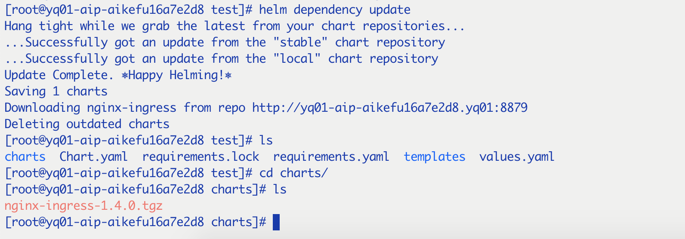

## 定义

> Chart是Helm软件包的格式。chart 是描述相关的一组 Kubernetes 资源的文件集合。单个 chart 可能用于部署简单的东西，比如 memcached pod，或者一些复杂的东西，比如完整的具有 HTTP 服务，数据库，缓存等的 Web 应用程序。

## Chart文件结构

> 一个Chart是一个目录下的文件集合。目录的名字就是chart的名字(不包含版本信息)。例如，WordPress的chart存储在 ```/WordPress```目录下：

helm期望的目录结构如下：
```
wordpress/
    Chart.yaml          # yaml文件，包含chart的信息
    LICENSE             # 可选的: A plain text file containing the license for the chart
    README.md           # 可选的: A human-readable README file
    requirements.yaml   # 可选的: yaml文件，chart的依赖列表
    values.yaml         # 该chart的默认配置参数
    charts/             # 包含该chart依赖的charts
    templates/          # templates目录，和values共同生成k8s的有效清单文件
    templates/NOTES.txt # 可选的: A plain text file containing short usage notes
```
Helm 保留使用 charts / 和 templates / 目录以及上面列出的文件名称。其他

### Chart.yml

> Chart.yml文件包含chart的元信息,包含下列字段：

```
apiVersion:     chart的API版本，指定是'v1'(required)          
name:           chart名字(required)
version:        SemVer格式的chart版本 (required)
kubeVersion:    可兼容的K8s版本 (optional)
description:    说明 (optional)
keywords:
  - xx          该工程的关键字 (optional)
home:           项目首页url(optional)
sources:
  - xx          项目源码的url列表 (optional)
maintainers:    # (optional)
  - name:       The maintainer's name (required for each maintainer)
    email:      The maintainer's email (optional for each maintainer)
    url:        A URL for the maintainer (optional for each maintainer)
engine: gotpl   template引擎，默认是go模板 (optional, defaults to gotpl)
icon: xx        icon的url (optional).
appVersion:     chart包含的app版本(optional). This needn't be SemVer.
deprecated:     chart是否过时(optional, boolean)
tillerVersion:  chart使用的tiller版本， This should be expressed as a SemVer range: ">2.0.0" (optional)
```
* Charts版本

    version字段，必须是SemVer 2标准格式的。version字段在Helm客户端和Tiller服务端都有用到，当生成一个软件包时，```helm package```命令会按照Chart.yml文件中的version字段来命名软件包名字。

    例如nginx的chart的version: 1.2.3，则生成：nginx-1.2.3.tgz

* appVersion字段

    和version字段没有任何关系，是用来指定Chart中的应用的版本的。

### LICENSE, README AND NOTES

* LICENSE
* README.md
* templates/NOTES.txt
  
    当使用```helm install```, ```helm status```会展示该NOTES.txt的内容

### Chart的依赖

> 一个chart可以依赖任意数量的其他charts，这些依赖可以通过requirement.yaml动态链接或者在charts/目录下手动添加。

**Note**: 在Chart.yml中使用dependencies:在2.16后已完全移除，官方提倡使用requirement.yaml。

* requirements.yaml

    ```
    dependencies:
      - name: nginx-ingress
        version: 1.4.0
        repository: http://yq01-aip-aikefu16a7e2d8.yq01:8879
      - name: xx
        version: 0.1.0
        repository: aa.ada.sa
    ```
    * name: 需要的chart的name
    * version:对应的版本
    * repository: chart所在repo的地址, 可以使用```helm repo add```加入到本地

    可以使用```helm dependency update [Chart-name]```, 将对应的依赖下载到charts目录下

    

    附加参数：
      * alias：别名，对于使用相同的chart，可以指定别名来用多个
      * tags和condition：指定子chart是否能用的两个标签，condition是对tags的重写；详见https://v2.helm.sh/docs/developing_charts/#tags-and-condition-fields-in-requirements-yaml
      * import-values和exports：import-values是父chart的requirements.yaml中的参数，exports是子chart的values.yaml中的参数

* charts/目录

> 可以在charts目录下放置压缩或者解压文件，依赖chart的名字不能以_或者.开头，这种会被helm忽略。

```helm fetch```可以删除一个chart的依赖

## Templates和Values


