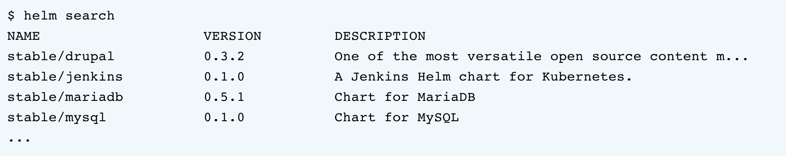
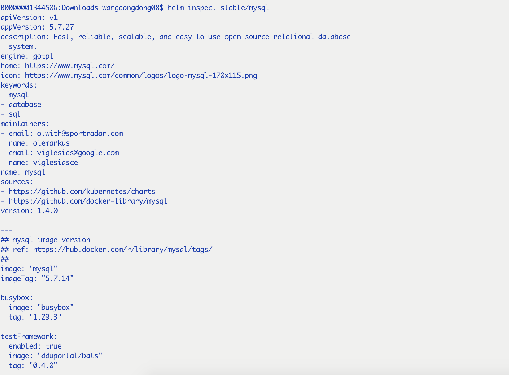
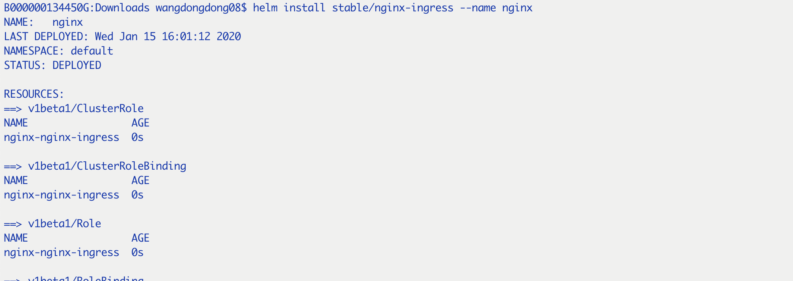

## 三个概念

1. Chart: helm的软件包，可以类比于Yum RPM file,Apt dpkg，window的exe(个人觉得),包含了一个运行在k8s集群中的应用、工具或者服务的所有必要资源的定义。
2. Repository: k8s软件包仓库，收集和分享Chart
3. Release: 实实在在的本地k8s集群内部跑的程序或者服务,一个Chart可以运行多个Release实例，但每个实例name不能一样

> 基于上述三个概念，可以理解helm：helm安装charts到k8s，每一个安装生成一个release，可以在repository中查找新的charts

## helm 使用

1. helm search 
   
2. helm inspect 
   
3. helm install --name xxx
   

   * 3.1 helm支持在repo版本上进行定制化修改:

     * --values(-f):指定YAML文件进行重写
     * --set : 在命令行进行重写,两者都用时，--set会合入--values，可以使用helm get values <release-name>来查看--set的值，当upgrade时，--set的会被清空，需要--reset-values在指定
     * --set的语法详见 https://v2.helm.sh/docs/using_helm/#the-format-and-limitations-of-set

   * 3.2 helm install 的各种用法
      * chart repo
      * 本地chart archive:  helm install foo-0.1.1.tgz
      * chart目录: helm install path/foo
      * url: helm install https://example.com/charts/foo-1.2.3.tgz

4. helm upgrade
    ```
    helm upgrade -f xx.yml [RELEASE] [chart]
    ```
    将会按照yml文件中指定的参数进行升级

    升级后可以通过helm get values [RELEASE]来查看

5. helm rollback
    ```
    helm history [RELEASE]
    helm rollback [RELEASE] [REVISION]
    ```

6. helm delete
    ```
    helm delete [RELEASE]
    helm会把status改成deleted 
    ```
    因为helm不是真的把release删了，所以release-name要复用的话，就要添加--replace参数
    ```
    helm install [chart] --replace --name [RELEASE]
    ```
    helm删除的也可以回滚，除非彻底删除：
    ```
    helm del --purge [RELEASE]
    ```

7. helm list
   ```
   helm ls --all
   helm ls --deleted
   ```

8. helm repo 
   
   helm 仓库管理，可以添加和更新仓库
   ```
   helm repo list
   helm repo add dev https://example.com/dev-charts
   helm repo update
   ```

9. 一些额外参数(install/rollback/upgrade)

    * --timeout: k8s命令执行超时时间，超过自动失败
    * --wait: 等待所有的pod都处于ready状态
    * --no-hooks: 跳过running hooks
    * --recreate-pods: 涉及到的pod都要重新建立，适用于upgrade、rollback

   