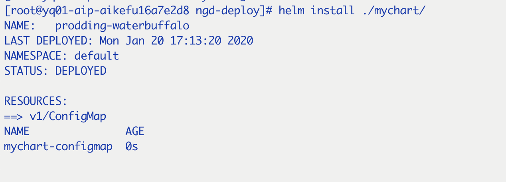
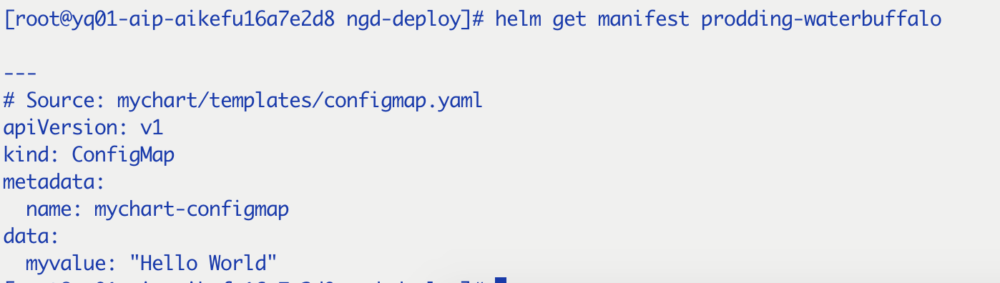

Templates生成k8s能够解析的YAML格式的清单文件。该节将探讨templates的结构，如何被使用，怎么写go模板，怎么debug。

## starter

```
helm create mychart
rm -rf mychart/templates/*.*
```

## 第一个模板

首先建一个configmap，因为cm是基础资源，其他的例如pods会从cm获取数据

* 新建configmap.yaml:
```
apiVersion: v1
kind: ConfigMap
metadata:
  name: mychart-configmap
data:
  myvalue: "Hello World"
```
* 安装：
```
helm install ./mychart
```

* 查看：
```
helm get manifest <release name>
```

* 删除
```
helm delete <release name>
```

## 简单的template调用

上个的name是硬编码的，下面通过template调用来实现，其中 name: 字段DNS限制了63字节，所以release name应在53字节之内，k8s1.3及之前14字节。
* 修改
```
apiVersion: v1
kind: ConfigMap
metadata:
  name: {{ .Release.Name }}-configmap
data:
  myvalue: "Hello World"
```
* 安装
```
helm install ./mychart
NAME: clunky-serval
LAST DEPLOYED: Tue Nov  1 17:45:37 2019
NAMESPACE: default
STATUS: DEPLOYED

RESOURCES:
==> v1/ConfigMap
NAME                      DATA      AGE
clunky-serval-configmap   1         1m
```
* 非安装检查
```
helm install ./mychart --debug --dry-run
```
可以生成ouput，但是不会安装，便于检查。

## Values文件

* Values.yaml
```
favoriteDrink: coffee
```
* configmap.yaml
```
apiVersion: v1
kind: ConfigMap
metadata:
  name: {{ .Release.Name }}-configmap
data:
  myvalue: "Hello World"
  drink: {{ .Values.favoriteDrink }}
```
* 测试
```
helm install --debug --dry-run ./mychart
```
* --set命令，优先级高于values.yaml
```
helm install --dry-run --debug --set favoriteDrink=slurm ./mychart
```

## template的函数和管道

到目前为止，我们已经知道如何在template中放置信息，但这些信息是没被修改的。有时，我们需要在某种程度上对数据进行转换，使得更适用于我们。

helm支持60种以上的函数，一些使用go语言定义，大多数是Sprig模板库的。

* 管道

模板语言的强大功能之一是管道。类比UNIX的概念，管道可以将一系列模板命令串在一起，来表示一系列的转换操作。换句话说，管道就是在一个队列中表示多个执行动作的高效方式。

例如repeat函数、upper|lower 函数 、 quote函数：
```
apiVersion: v1
kind: ConfigMap
metadata:
  name: {{ .Release.Name }}-configmap
data:
  myvalue: "Hello World"
  drink: {{ .Values.favorite.drink | repeat 5 | quote }}
  food: {{ .Values.favorite.food | upper | quote }}
```
输出结果：
```
apiVersion: v1
kind: ConfigMap
metadata:
  name: melting-porcup-configmap
data:
  myvalue: "Hello World"
  drink: "coffeecoffeecoffeecoffeecoffee"
  food: "PIZZA"
```

* default函数

语法格式：
```
drink: {{ .Values.favorite.drink | default "tea" | quote }}
```
default函数支持写表达式：
```
drink: {{ .Values.favorite.drink | default (printf "%s-tea" (include "fullname" .)) }}
```

* 运算符函数

运算符函数会返回一个boolean值。语法格式：
```
eq,ne,lt,gt,and,or,not等等 + 参数
```
例子：
```
{{ /* .Values.fooString存在并且 .Values.fooString等于字符串 foo */}}
{{ if and .Values.fooString (eq .Values.fooString "foo") }}
    {{ ... }}
{{ end }}
```

```
{{ /* .Values.anUnsetVariable有值或者.Values.aSetVariable没值}}
{{ if or .Values.anUnsetVariable (not .Values.aSetVariable) }}
   {{ ... }}
{{ end }}
```

## Flow control

helm模板语言提供了一下的控制结构：

* if/else : 创建条件语句
* with : 定义一个范围
* range: 提供 "for each " 样式的循环

除了这些，helm还提供了声明和使用template片段的操作：
* define : 在template内部声明一个命名的template
* template: 导入一个template
* block: 声明一个可填充的template区域

### if/else

基本结构如下：
```
{{ if PIPELINE }}
  # Do something
{{ else if OTHER PIPELINE }}
  # Do something else
{{ else }}
  # Default case
{{ end }}
```
如上所示，if的条件不单单限制于values，可以是完整的pipline，当pipline为false的情况：
* boolean： false
* numeric : 0
* string: 空的
* nil(empty or null)
* 空集合： map,slice,tuple,dict,array
其他情况pipline条件都是true。

示例：
```
apiVersion: v1
kind: ConfigMap
metadata:
  name: {{ .Release.Name }}-configmap
data:
  myvalue: "Hello World"
  drink: {{ .Values.favorite.drink | default "tea" | quote }}
  food: {{ .Values.favorite.food | upper | quote }}
  {{ if and .Values.favorite.drink (eq .Values.favorite.drink "coffee") }}mug: true{{ end }}
```
输出：
```
# Source: mychart/templates/configmap.yaml
apiVersion: v1
kind: ConfigMap
metadata:
  name: maudlin-otter-configmap
data:
  myvalue: "Hello World"
  drink: "coffee"
  food: "PIZZA"
  mug: true
```

### 空格

YAML要求template的格式必须满足，上面的示例中，使用if语句和and，模板引擎虽然会去除and的内容，但是会留下空行。helm的模板对此提供了几种工具：

* {{- 和 -}}

{{- 意味着删除左边的空格，包括空行

实例：
```
apiVersion: v1
kind: ConfigMap
metadata:
  name: {{ .Release.Name }}-configmap
data:
  myvalue: "Hello World"
  drink: {{ .Values.favorite.drink | default "tea" | quote }}
  food: {{ .Values.favorite.food | upper | quote }}
  {{- if eq .Values.favorite.drink "coffee"}}
  mug: true
  {{- end}}
```

* indent缩进

有时，指定缩进比手动缩进更方便，指定缩进用到命令 indent
```
apiVersion: v1
kind: ConfigMap
metadata:
  name: {{ .Release.Name }}-configmap
data:
  myvalue: "Hello World"
  drink: {{ .Values.favorite.drink | default "tea" | quote  }}
  food: {{ .Values.favorite.food | upper | quote }}
  {{- if eq .Values.favorite.drink "coffee"}}
{{ indent 2 "mug:true" }}
  {{- end}}
```

### with

with 操作控制变量的作用域。回忆 '.'是当前范围的引用，所以 .Values 告知模板在当前范围查找Values。

with的语法格式：
```
{{ with PIPELINE }}
  # restricted scope
{{ end }}
```
继续按照上述示例：
```
apiVersion: v1
kind: ConfigMap
metadata:
  name: {{ .Release.Name }}-configmap
data:
  myvalue: "Hello World"
  {{- with .Values.favorite }}
  drink: {{ .drink | default "tea" | quote }}
  food: {{ .food | upper | quote }}
  {{- end }}
```

**Note**: 在with的范围内如果在引用父层的值时会报错，只能引用with限制的范围。

### range

在helm模板语言中，集合的迭代方法示使用range操作符。

示例：

values.yaml中:
```
favorite:
  drink: coffee
  food: pizza
pizzaToppings:
  - mushrooms
  - cheese
  - peppers
  - onions
```
configmap.yaml中:
```
apiVersion: v1
kind: ConfigMap
metadata:
  name: {{ .Release.Name }}-configmap
data:
  myvalue: "Hello World"
  {{- with .Values.favorite }}
  drink: {{ .drink | default "tea" | quote }}
  food: {{ .food | upper | quote }}
  {{- end }}
  toppings: |-
    {{- range .Values.pizzaToppings }}
    - {{ . | title | quote }}
    {{- end }}
```

结果:
```
# Source: mychart/templates/configmap.yaml
apiVersion: v1
kind: ConfigMap
metadata:
  name: edgy-dragonfly-configmap
data:
  myvalue: "Hello World"
  drink: "coffee"
  food: "PIZZA"
  toppings: |-
    - "Mushrooms"
    - "Cheese"
    - "Peppers"
    - "Onions"
```

其中： toppings: |- 意思是声明了一个多行的string,所以，实际上toppings并不是一个YAML list，而是一个大的字符串。


## 变量

在模板中，变量很少用到，但是其可以简化编码，并且能更好的使用 with和range操作符。在模板中，变量是对另一个实体的命名引用，格式：

$name,赋值操作符是 :=

示例：

在with 范围内使用：
```
apiVersion: v1
kind: ConfigMap
metadata:
  name: {{ .Release.Name }}-configmap
data:
  myvalue: "Hello World"
  {{- $relname := .Release.Name -}}
  {{- with .Values.favorite }}
  drink: {{ .drink | default "tea" | quote }}
  food: {{ .food | upper | quote }}
  release: {{ $relname }}
  {{- end }}
```

在range循环中使用：

list/slice:
```
toppings: |-
    {{- range $index, $topping := .Values.pizzaToppings }}
      {{ $index }}: {{ $topping }}
    {{- end }}
-----------------------
输出：
toppings: |-
      0: mushrooms
      1: cheese
      2: peppers
      3: onions
```
map:
```
apiVersion: v1
kind: ConfigMap
metadata:
  name: {{ .Release.Name }}-configmap
data:
  myvalue: "Hello World"
  {{- range $key, $val := .Values.favorite }}
  {{ $key }}: {{ $val | quote }}
  {{- end}}
--------------------------------
输出：
# Source: mychart/templates/configmap.yaml
apiVersion: v1
kind: ConfigMap
metadata:
  name: eager-rabbit-configmap
data:
  myvalue: "Hello World"
  drink: "coffee"
  food: "pizza"
```


## 命名模板

本节讲介绍如何在一个文件中定义模板，然后在其他地方应用。命名模板(有时叫partial或者子模板)就是定义在文件中的一个模板，并且有个名字。我们有两种创建方法，和几种使用方法。

当给模板命名时，请切记：模板是全局的。当有两个相同名字的模板时，最后被加载的模板将被使用。

### partials 和 _文件(以'_'开头的文件)

在开始编写模板之前，有一些文件命名的约定值得一提：
* templates/目录下的大多数文件被视为包含k8s清单
* NOTES.txt是个例外
* 以'_'开头的文件不被视为包含清单，不会被渲染成k8s的实例，但是在其他templates中可以使用，例如_helpers.tpl就是模板partials的默认位置。

### define和template

define允许我们在一个template文件中命名一个模板，语法：
```
{{ define "MY.NAME" }}
  # body of template here
{{ end }}
```
示例：
```
{{- define "mychart.labels" }}
  labels:
    generator: helm
    date: {{ now | htmlDate }}
{{- end }}
apiVersion: v1
kind: ConfigMap
metadata:
  name: {{ .Release.Name }}-configmap
  {{- template "mychart.labels" }}
data:
  myvalue: "Hello World"
  {{- range $key, $val := .Values.favorite }}
  {{ $key }}: {{ $val | quote }}
  {{- end }}
```
输出：
```
# Source: mychart/templates/configmap.yaml
apiVersion: v1
kind: ConfigMap
metadata:
  name: running-panda-configmap
  labels:
    generator: helm
    date: 2016-11-02
data:
  myvalue: "Hello World"
  drink: "coffee"
  food: "pizza"
```

一般情况下，我们通常把这些模板放在partials文件当中，一般是_helpers.tpl。而且为了能够不让两个template的name产生冲突，一般书写约定是在定义的template名称前加上chart的前缀。例如： {{ define "mychart.labels" }}

### 设置template的作用域

当在_helpers.tpl中定义模板为：
```
{{- define "mychart.labels" }}
  labels:
    generator: helm
    date: {{ now | htmlDate }}
    chart: {{ .Chart.Name }}
    version: {{ .Chart.Version }}
{{- end }}
```
如果在configmap.yaml中使用{{- template "mychart.labels" }}引用，在模板中定义的chart，version将不会显示，若想添加对于的作用域，引用要修改成：{{- template "mychart.laels" . }} , '.'代表顶层level，当然如果定义时用到的是其他level的，引用也要作对应的改变。

### include函数

template是一个动作(action)，而不是一个函数，所以没有办法将模板调用的输出传递给其他函数，数据的插入只是内联插入。

为了解决这种情况，helm提供了template的替代方法，将模板的内容导入到当前管道，并在管道中将其传递给其他函数,include函数。

示例：
```
{{- define "mychart.app" -}}
app_name: {{ .Chart.Name }}
app_version: "{{ .Chart.Version }}+{{ .Release.Time.Seconds }}"
{{- end -}}
```
```
apiVersion: v1
kind: ConfigMap
metadata:
  name: {{ .Release.Name }}-configmap
  labels:
    {{- include "mychart.app" . | nindent 4 }}
data:
  myvalue: "Hello World"
  {{- range $key, $val := .Values.favorite }}
  {{ $key }}: {{ $val | quote }}
  {{- end }}
  {{- include "mychart.app" . | nindent 2 }}
```
输出：
```
# Source: mychart/templates/configmap.yaml
apiVersion: v1
kind: ConfigMap
metadata:
  name: edgy-mole-configmap
  labels:
    app_name: mychart
    app_version: "0.1.0+1478129987"
data:
  myvalue: "Hello World"
  drink: "coffee"
  food: "pizza"
  app_name: mychart
  app_version: "0.1.0+1478129987"
```

## Files

helm通过.Files对象提供了对文件的访问。其工作大致如下：
* 可以在helm chart中增加额外的文件。这些文件将会被打包并发给tiller。但由于k8s的限制，charts必须小于1M。
* 一些文件由于安全原因不能通过.Files访问：
  * templates/ 目录下的文件不能被访问
  * 被.helmignore排除的文件不能
* charts不会保留unix模式信息，因此，文件的权限对于.Files不会有任何影响

示例：

三个文件：
```
config1.toml:
    message = "Hello from config 1"
config2.toml:
    message = "This is config 2"
config3.toml:
    message = "Goodbye from config 3"
```
configmap.yaml: 其中变量$files是 .Files的引用，{{ $files.Get . }}打印的是对应文件的内容
```
apiVersion: v1
kind: ConfigMap
metadata:
  name: {{ .Release.Name }}-configmap
data:
  {{- $files := .Files }}
  {{- range list "config1.toml" "config2.toml" "config3.toml" }}
  {{ . }}: |-
    {{ $files.Get . }}
  {{- end }}
```
### PATH helpers

在处理文件时，对文件路径的操作可能非常有用。helm提供了以下函数：
* base
* dir
* ext
* isAbs
* clean

### glob pattern

语法：
```
Files.Glob(pattern string)
```
示例：

目录结构：
```
foo/:
  foo.txt foo.yaml

bar/:
  bar.go bar.conf baz.yaml
```
```
{{ $root := . }}
{{ range $path, $bytes := .Files.Glob "foo/*" }}
{{ base $path }}: '{{ $root.Files.Get $path | b64enc }}'
{{ end }}
```

### configmap和secrets函数、encode、lines

在configmap.yaml中：
```
{{- (.Files.Glob "bar/*").AsSecrets | nindent 2 }}
```

encode：
```
data:
  token: |-
    {{ .Files.Get "config1.toml" | b64enc }}
```

lines：一行一行的打印文件的内容
```
data:
  some-file.txt: {{ range .Files.Lines "foo/bar.txt" }}
    {{ . }}{{ end }}
```

## NOTES.txt

当执行```helm install ```或者```helm upgrade```命令后，会输出NOTES.txt的内容,NOTES.txt可以按照template来写：

示例：
```
Thank you for installing {{ .Chart.Name }}.

Your release is named {{ .Release.Name }}.

To learn more about the release, try:

  $ helm status {{ .Release.Name }}
  $ helm get {{ .Release.Name }}
```

## debuging Templates

调试templates可能会很棘手，因为模板是在tiiler服务器上渲染的，而不是helm客户端。然后被渲染的模板会被发送给k8s API server，可能会因为由于格式以外的原因被拒。

helm支持的命令：
* helm lint
* helm install --dry-run --debug: 即使是注释的template片段，也可以被解析
* helm get manifest
